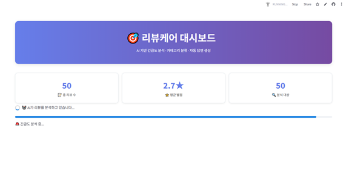
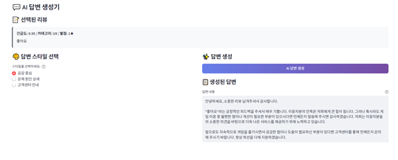
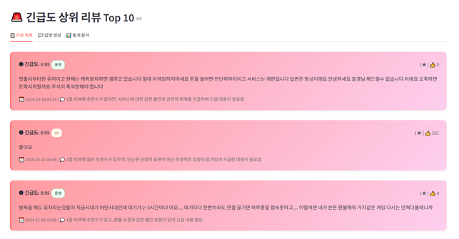
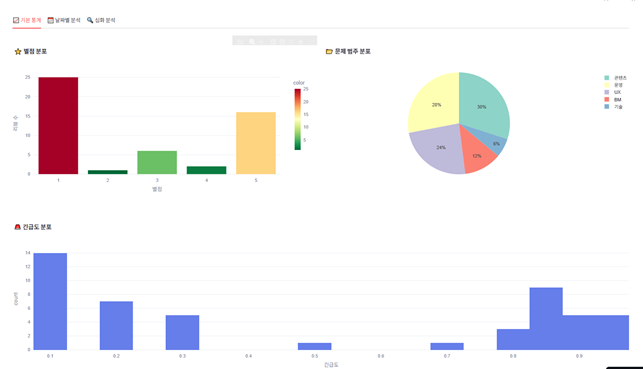
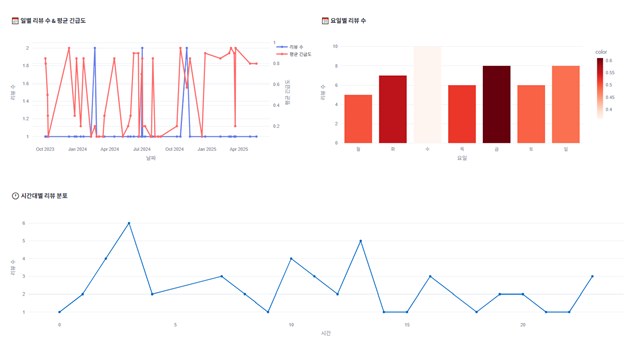
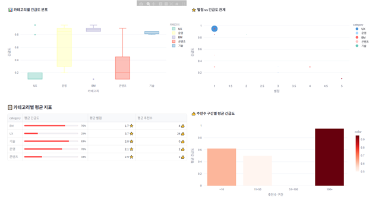

# 리뷰케어 대시보드 (ReviewCare Dashboard)

게임 이용자 리뷰를 **카테고리 분류**, **긴급도(우선순위) 평가**, **CS 답변 자동 생성**까지 한 번에 지원하는 Streamlit 기반 대시보드입니다.  
캡스톤디자인 프로젝트로, 앱 마켓(Google Play) 리뷰 대응의 “형식적·일률적 답변” 문제를 줄이고 **빠르고 일관된 대응 + 중요한 이슈 우선 처리**를 목표로 했습니다.

- **팀**: 최정현, 정환웅
- **기간**: 2025.06
- **키워드**: LLM, 리뷰 분석, 우선순위(긴급도), 분류, 자동 응답, Streamlit 대시보드

## 데모 이미지 (추가 업로드 필요)
포트폴리오 용도로 **보고서 Fig1~Fig6 스크린샷**을 `docs/images/`에 아래 파일명으로 넣어주면 README에서 바로 보이게 구성해뒀어요.

- `docs/images/01_main.png` — Fig1) 메인 화면
- `docs/images/02_ai_reply.png` — Fig2) AI 답변 생성 시스템
- `docs/images/03_top10.png` — Fig3) 긴급도 상위 리뷰 TOP10
- `docs/images/04_weekday_category.png` — Fig4) 요일, 범주 통계 시각화
- `docs/images/05_time_weekday.png` — Fig5) 시간대별, 요일별 통계량 시각화
- `docs/images/06_advanced.png` — Fig6) 심화 통계량 시각화

이미지 넣은 뒤 아래가 자동으로 표시됩니다.








## 핵심 기능
- **CSV 업로드 기반 분석**: 리뷰 데이터 파일을 업로드하면 즉시 분석 결과를 대시보드로 제공
- **카테고리 자동 분류**: `BM / 기술 / 운영 / UX / 콘텐츠 (+기타)`
- **긴급도(0~1) 추정 + 사유(reason) 제공**: 별점/추천수/본문 맥락을 종합해 대응 우선순위를 제안
- **Top 10 우선 처리 뷰**: 긴급도가 높은 리뷰를 카드 형태로 시각화
- **CS 답변 자동 생성(3가지 스타일)**:
  - 공감 중심
  - 문제 원인 상세
  - 고객센터 안내
- **비공식 표현/은어 순화**: 답변을 공식적이고 중립적인 톤으로 생성
- **통계 분석 시각화**: 별점/긴급도/카테고리 분포, 요일·시간대 트렌드, 산점도/박스플롯 등

## 기술 스택
- **Frontend**: Streamlit
- **Backend**: Python
- **LLM**: OpenAI Chat Completions API
- **Data**: Pandas
- **Viz**: Plotly (Express / Graph Objects)
- **Deploy(예정/가능)**: Streamlit Community Cloud

## 입력 데이터 형식 (CSV)
업로드하는 CSV에 아래 컬럼이 필요합니다.

- `content`: 리뷰 본문 (text)
- `score`: 별점 (number)
- `thumbsUpCount`: 추천수 (number)
- `at`: 작성 시각 (datetime, 선택)  
  - 없으면 현재 시각으로 대체합니다.

## 실행 방법 (로컬)
### 1) 설치
Python 3.10+ 권장.

```bash
pip install -r requirements.txt
```

### 2) OpenAI API Key 설정 (필수)
이 프로젝트는 `st.secrets["OPENAI_API_KEY"]`를 사용합니다.

- 파일 생성: `.streamlit/secrets.toml`
- 예시 파일: `.streamlit/secrets.toml.example` 참고

```toml
OPENAI_API_KEY = "YOUR_OPENAI_API_KEY"
```

> **중요**: `.streamlit/secrets.toml`은 절대 커밋하지 마세요. (`.gitignore`에 포함됨)

### 3) 실행
```bash
streamlit run app.py
```

## 구현 개요 (포트폴리오 요약)
### 긴급도 산출
별점/추천수/본문 표현을 함께 고려해 \(0 \sim 1\) 사이 점수를 반환하도록 프롬프트를 구성했습니다.  
또한 결과를 **JSON 형식**으로 강제하여 파싱 안정성을 확보했습니다.

### 카테고리 분류
게임 CS 관점에서 리뷰를 `BM/기술/운영/UX/콘텐츠` 5개 중 하나로만 반환하도록 제한하고,  
중복 호출을 줄이기 위해 Streamlit 캐싱을 적용했습니다.

### 답변 생성
“공감–사과–해결방안–후속 안내” 흐름을 포함하도록 유도하고, 은어·비속어는 공식 용어로 순화하도록 제약을 넣었습니다.

## 한계 및 개선 방향
- **비용/지연**: LLM 호출은 비용과 레이턴시가 발생 → 배치 처리/캐싱 강화, 모델 선택 옵션, 요약 기반 2단계 파이프라인 등으로 개선 여지
- **평가 지표**: 정답 라벨이 있는 벤치마크가 제한적 → 휴먼 평가/샘플링 기반 품질 관리 체계 필요
- **도메인 적합성**: 장르/게임별 용어 차이 → 도메인 사전/룰 기반 보정 또는 RAG 적용 여지

## 레포 구조
- `app.py`: Streamlit 대시보드 메인
- `requirements.txt`: 파이썬 의존성
- `docs/`: 문서/이미지 폴더
  - `docs/images/`: README용 스크린샷(직접 추가)
- `.streamlit/`: Streamlit 설정/시크릿(로컬)

## 문서
- 최종 보고서(HWP)는 `docs/`로 옮겨 `final_report.hwp` 같은 영문 파일명으로 관리하는 걸 권장합니다.